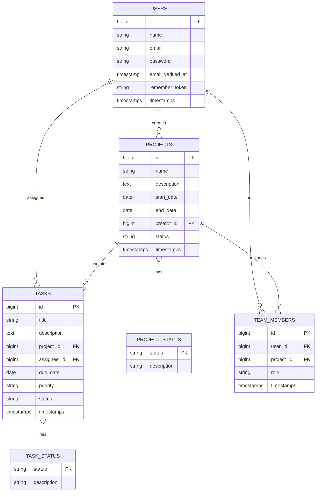

# 🗄️ Database Schema

Dokumentasi struktur database Management Crew.

## 📊 Diagram ERD



## 📝 Detail Tabel

### Users

| Column | Type | Description |
|--------|------|-------------|
| id | bigint | Primary key |
| name | string | Nama lengkap user |
| email | string | Email user (unique) |
| password | string | Password terenkripsi |
| email_verified_at | timestamp | Waktu verifikasi email |
| remember_token | string | Token untuk "remember me" |
| created_at | timestamp | Waktu pembuatan |
| updated_at | timestamp | Waktu update terakhir |

### Projects

| Column | Type | Description |
|--------|------|-------------|
| id | bigint | Primary key |
| name | string | Nama proyek |
| description | text | Deskripsi proyek |
| start_date | date | Tanggal mulai |
| end_date | date | Tanggal selesai |
| creator_id | bigint | Foreign key ke users |
| status | string | Status proyek |
| created_at | timestamp | Waktu pembuatan |
| updated_at | timestamp | Waktu update terakhir |

### Tasks

| Column | Type | Description |
|--------|------|-------------|
| id | bigint | Primary key |
| title | string | Judul task |
| description | text | Deskripsi task |
| project_id | bigint | Foreign key ke projects |
| assignee_id | bigint | Foreign key ke users |
| due_date | date | Deadline task |
| priority | string | Prioritas task |
| status | string | Status task |
| created_at | timestamp | Waktu pembuatan |
| updated_at | timestamp | Waktu update terakhir |

### Team Members

| Column | Type | Description |
|--------|------|-------------|
| id | bigint | Primary key |
| user_id | bigint | Foreign key ke users |
| project_id | bigint | Foreign key ke projects |
| role | string | Peran dalam tim |
| created_at | timestamp | Waktu pembuatan |
| updated_at | timestamp | Waktu update terakhir |

## 🔑 Indexes

### Users
- `PRIMARY KEY` pada `id`
- `UNIQUE INDEX` pada `email`

### Projects
- `PRIMARY KEY` pada `id`
- `INDEX` pada `creator_id`
- `INDEX` pada `status`

### Tasks
- `PRIMARY KEY` pada `id`
- `INDEX` pada `project_id`
- `INDEX` pada `assignee_id`
- `INDEX` pada `status`

### Team Members
- `PRIMARY KEY` pada `id`
- `INDEX` pada `user_id`
- `INDEX` pada `project_id`
- `UNIQUE INDEX` pada kombinasi `user_id` dan `project_id`

## 🔄 Relationships

### Users
- `1:N` dengan `Projects` (sebagai creator)
- `1:N` dengan `Tasks` (sebagai assignee)
- `1:N` dengan `Team Members`

### Projects
- `N:1` dengan `Users` (creator)
- `1:N` dengan `Tasks`
- `1:N` dengan `Team Members`

### Tasks
- `N:1` dengan `Projects`
- `N:1` dengan `Users` (assignee)

### Team Members
- `N:1` dengan `Users`
- `N:1` dengan `Projects`

## 📋 Enums

### Project Status
```php
enum ProjectStatus: string {
    case PLANNING = 'planning';
    case ACTIVE = 'active';
    case ON_HOLD = 'on_hold';
    case COMPLETED = 'completed';
    case CANCELLED = 'cancelled';
}
```

### Task Status
```php
enum TaskStatus: string {
    case TODO = 'todo';
    case IN_PROGRESS = 'in_progress';
    case REVIEW = 'review';
    case COMPLETED = 'completed';
}
```

### Task Priority
```php
enum TaskPriority: string {
    case LOW = 'low';
    case MEDIUM = 'medium';
    case HIGH = 'high';
    case URGENT = 'urgent';
}
```

### Team Member Role
```php
enum TeamMemberRole: string {
    case OWNER = 'owner';
    case MANAGER = 'manager';
    case MEMBER = 'member';
    case VIEWER = 'viewer';
}
``` 